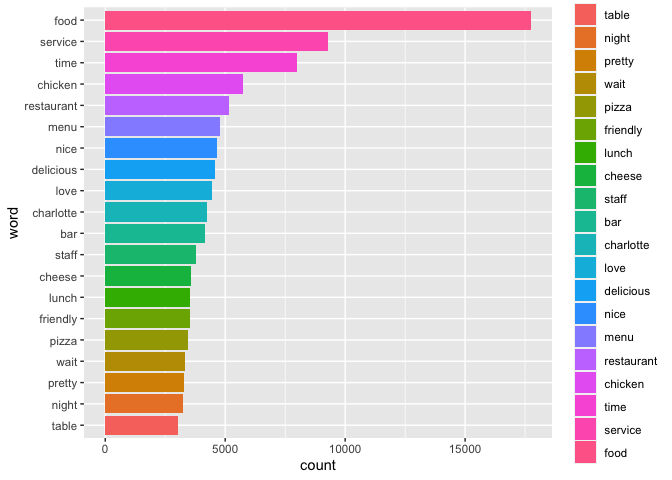

Lab 3: Text mining and sentiment analysis
================

## Text mining

In the second half of this lab, you’ll do some basic text mining and
sentiment analysis using data from the (now defunct) [Yelp data
challenge](https://www.yelp.com/dataset/challenge/winners).
Specifically, you’ll be looking at reviews for businesses in Charlotte,
NC. This file is available in the data folder of this lab repo.

**IMPORTANT**: Yelp has some restrictions on these data, primarily that
it cannot be shared publicly or used for publication/analysis. You are
free to use it for this lab or for personal research, but you cannot
reuse it for other public facing projects. Yelp now has a public version
of their data available at [this link](https://www.yelp.com/dataset).

``` r
library(tidyverse)
```

    ## ── Attaching packages ─────────────────────────────────────── tidyverse 1.3.1 ──

    ## ✓ ggplot2 3.3.5     ✓ purrr   0.3.4
    ## ✓ tibble  3.1.4     ✓ dplyr   1.0.7
    ## ✓ tidyr   1.1.3     ✓ stringr 1.4.0
    ## ✓ readr   2.0.1     ✓ forcats 0.5.1

    ## ── Conflicts ────────────────────────────────────────── tidyverse_conflicts() ──
    ## x dplyr::filter() masks stats::filter()
    ## x dplyr::lag()    masks stats::lag()

``` r
library(tidytext)
library(knitr)

yelp_data<-read_csv("data/charlotte_restaurants_v2_25k.csv")
```

    ## Rows: 25000 Columns: 22

    ## ── Column specification ────────────────────────────────────────────────────────
    ## Delimiter: ","
    ## chr  (5): business_id, review_id, name, address, text
    ## dbl (17): date, postal_code, latitude, longitude, review_count, stars, Ameri...

    ## 
    ## ℹ Use `spec()` to retrieve the full column specification for this data.
    ## ℹ Specify the column types or set `show_col_types = FALSE` to quiet this message.

These data include multiple variables about businesses listed in Yelp.
In this case, only restaurants are included, and there are dummy
variables (0/1) for the 10 most common restaurant categories. Here’s a
list of them and the count of reviews in each:

``` r
rest_table<-yelp_data %>%
  pivot_longer(`American..New.`:Sandwiches,
               names_to="type",
               values_to="pres") %>%
  group_by(type) %>%
  summarise(count=sum(pres)) %>%
  arrange(-count)
```

    ## Warning: One or more parsing issues, see `problems()` for details

``` r
kable(rest_table)
```

| type                   | count |
|:-----------------------|------:|
| Restaurants            | 22890 |
| Food                   |  7754 |
| Nightlife              |  6849 |
| Bars                   |  6592 |
| American..New.         |  4987 |
| American..Traditional. |  4553 |
| Breakfast…Brunch       |  4062 |
| Sandwiches             |  2924 |
| Pizza                  |  2294 |
| Mexican                |  2093 |
| Burgers                |  2088 |

**Question 1**: Identify the 20 most common words in these reviews,
first filtering out the stopwords using an anti\_join as shown in the
class script for text mining. You can use the top\_n function to select
the 20 most common words. Use the arrange function to order your results
from highest to lowest as shown in the table above. Use kable to call
the table with your results when done.

``` r
reviews_words <- yelp_data  %>%
  unnest_tokens(word, text)

most_common <- reviews_words %>%
  anti_join(stop_words) %>%
  group_by(word) %>%
  summarise(count=n())
```

    ## Joining, by = "word"

``` r
common_top20 <-most_common %>%
  top_n(20) %>% 
  mutate(word=reorder(word,count)) %>%
  arrange(-count)
```

    ## Selecting by count

``` r
kable(head(common_top20))
```

| word       | count |
|:-----------|------:|
| food       | 17747 |
| service    |  9294 |
| time       |  7987 |
| chicken    |  5744 |
| restaurant |  5168 |
| menu       |  4777 |

**Question 2**: Using ggplot, create a bar plot showing the frequency of
these most common words. The class script on text mining has an example
of how to do this using geom\_col. Note that you’ll have to use the
reorder function (shown in the class script on text mining) to order
these bars from high to low values.

``` r
ggplot(common_top20, aes(x=word, y=count, fill=word)) +
  geom_bar(stat="identity") +
  coord_flip()
```

<!-- -->

**Question 3**: Now let’s compare two types of restaurants. Create two
datasets–one for *five star* reviews and one for *one star*
reviews–using filter with the “stars” variable. Using the same process
of question 1, identify the 20 most common words (not counting stop
words) in each type of review (one/five star). Use kable to call the
head of your table when done.

``` r
fivestar_reviews <- reviews_words %>%
  filter(stars=="5")

fivestar_mostcommon <- fivestar_reviews %>%
  anti_join(stop_words) %>%
  group_by(word) %>%
  summarise(count=n())
```

    ## Joining, by = "word"

``` r
fivestar_top20 <-fivestar_mostcommon %>%
  top_n(20) %>% 
  mutate(word=reorder(word,count))
```

    ## Selecting by count

``` r
onestar_reviews <- reviews_words %>%
  filter(stars=="1")

onestar_mostcommon <- onestar_reviews %>%
  anti_join(stop_words) %>%
  group_by(word) %>%
  summarise(count=n())
```

    ## Joining, by = "word"

``` r
onestar_top20 <- onestar_mostcommon %>%
  top_n(20) %>% 
  mutate(word=reorder(word,count))
```

    ## Selecting by count

``` r
kable(head(fivestar_top20))
```

| word      | count |
|:----------|------:|
| amazing   |    45 |
| beer      |    62 |
| charlotte |    42 |
| chicken   |    37 |
| chili     |    34 |
| coffee    |    36 |

``` r
kable(head(onestar_top20))
```

| word   | count |
|:-------|------:|
| 10     |     6 |
| 15     |     9 |
| 2      |     7 |
| beans  |     6 |
| call   |     6 |
| called |    12 |

**Question 4**: Looking at your results in question 3, identify *two*
notable difference in the words used for one star and five star reviewed
restaurants.

One big difference in these data frames is the sentiment of the 20 most
common words. If we performed a sentiment analysis, one star reviews
would be dominated by negative words and five star reviews would be
dominated by positive words. “Worst” and “horrible” are negative words
that were in the top 20 list for one star reviews, and “friendly,
delicious, amazing” were in the top 20 list for five star reviews.
Another notable difference is that “vic” and “staff” are included in the
five star list. I assume that vic is the owner of a highly rated
restaurant and that he and the staff make an effort to talk to all
customers, creating a friendly and welcoming atmosphere.

**Question 5**: Which burger restaurants had the most positive reviews?
Filter the dataset so you only have restaurants classified as Burger
(meaning they have a 1 in that column). Tokenize the words used in
reviews and join sentiments from the Bing sentiment dictionary. Use
group\_by and summarise to count the number of positive, negative, and
non-rated words by restaurant name. Then make the data wider so that all
three counts are separate variables. Call the head of your table when
done.\*

``` r
bing_sentiments <- get_sentiments("bing")

Burgers_analysis <- yelp_data %>%
  filter(Burgers=="1") %>%
  unnest_tokens(word,text) %>%
  anti_join(stop_words) %>%
  left_join(bing_sentiments) %>%
  group_by(name,sentiment) %>%
  summarise(count=n()) %>%
  pivot_wider(names_from=sentiment,
              values_from=count,
              values_fill=0)
```

    ## Joining, by = "word"
    ## Joining, by = "word"

    ## `summarise()` has grouped output by 'name'. You can override using the `.groups` argument.

``` r
kable(head(Burgers_analysis))
```

| name                    | negative | positive |  NA |
|:------------------------|---------:|---------:|----:|
| Adams 7th Street Market |        5 |       12 | 123 |
| American Burger         |        6 |       15 |  73 |
| American Burger Co.     |       40 |       61 | 602 |
| Arby’s                  |        2 |       14 |  82 |
| Arthur’s At Belk        |       16 |       37 | 267 |
| B.GOOD                  |        9 |       30 | 171 |

**Question 6**: Use mutate to calculate the percentage of positive words
for each restaurant, dividing each by the sum of counts you calculated
in question 5 (positive, negative, and non-rated). Then filter to select
restaurants with at least 1,500 total words. Which restaurant had the
highest percentage of positive words?

``` r
Burgers_positive_percentage <- Burgers_analysis %>%
  mutate(pos_rate=(positive / (negative+positive+`NA`) *100)) %>%
  mutate(total= (negative+positive+`NA`)) %>%
  filter(total>1500)
```

For restaurants with at least 1,500 total words, Village Tavern had the
highest percentage of positive words.

**Question 7**: *How do you feel about the work you did on this lab? Was
it easy, moderate, or hard? What were the biggest things you learned by
completing it? How would you rate it low pass/pass/high pass)?*

I feel like I did well on this lab. I was able to complete questions 1-4
easily and by myself. I needed a little guidance for questions 5 and 6
and then I figured out these questions. This was an easy/moderate lab-
the first half was easy but question 5 was a tad more tricky since it
had so many elements. I can tell that I am improving in this course and
on labs. I enjoyed doing text mining and I was able to grow my
understanding of this type of analysis through this lab. I do want to
improve my style of coding. I spread out my data frames rather than
condensing them into one new data frame (this process quickly crowds my
environment tab). I think question 3 has more data frames than it really
needed, however, this helps me mentally organize and process what
code/analysis that I am conducting (which is especially useful as I am
still learning this language). I would rate this lab a high pass.
